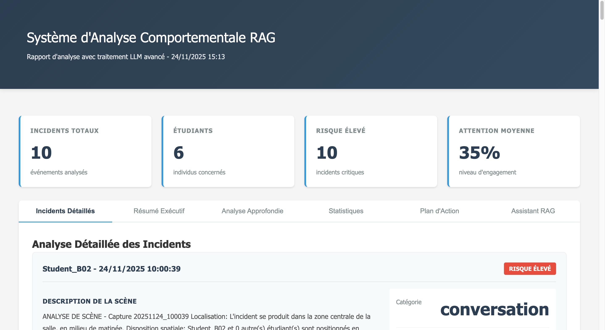
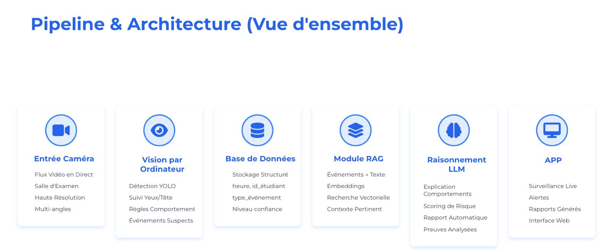
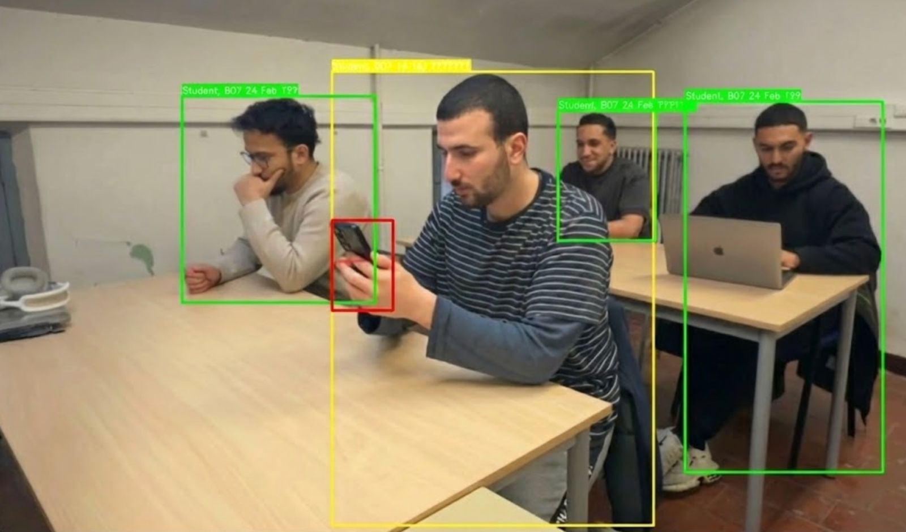

# ClassWatch AI  
### Système Avancé de Monitoring d’Attention en Environnement Pédagogique  
**Hackathon LLM – 24 Novembre 2025**  
**Équipe : Khalid Rekkassi · Ali Houaoui · Youcef Belhadef · Bilel Keddari**

---



## 1. Introduction

ClassWatch AI est une solution intégrée de monitoring d’attention conçue pour les environnements pédagogiques.  
Elle combine la vision par ordinateur, l’analyse comportementale et les modèles de langage avancés (LLM) afin de fournir une évaluation en temps réel de l’engagement des étudiants.

Le projet a été développé dans le cadre du Hackathon LLM 2025, avec pour objectif de démontrer l’efficacité de l’IA dans l’amélioration de la qualité d’enseignement et du pilotage pédagogique.

---

## 2. Objectifs du Projet

- Fournir un système automatisé permettant de mesurer l’attention des étudiants.  
- Identifier les comportements non conformes (distraction, conversations, usage du téléphone).  
- Offrir un tableau de bord temps réel.  
- Générer des rapports exploitables par les enseignants.  
- Illustrer une intégration multimodale complète (vision + NLP + RAG).

---

## 3. Architecture Fonctionnelle

La solution repose sur trois modules principaux :



### 3.1. Vision par Ordinateur
- Détection d’objets via YOLO v8 (personnes, téléphones).  
- Reconnaissance faciale via MediaPipe.  
- Suivi persistant des étudiants.  
- Détection d’événements : distraction, conversation, proximité.



### 3.2. Analyse IA & Comportement
- Classification des événements (new_student, orange, red, conversation, proximity).  
- Captures contextualisées automatiques.  
- Archivage structuré avec métadonnées.

### 3.3. Intelligence Artificielle Conversationnelle
- Intégration des API Google Gemini et Groq.  
- Analyse, synthèse, génération de rapports.  
- Module RAG pour analyses multi-dossiers.


---

## 4. Caractéristiques Clés

- Détection et tracking en temps réel.  
- Statistiques instantanées d’engagement.  
- Interface web ergonomique.  
- Rapports générés automatiquement.  
- Analyse comportementale sur plusieurs sources.  
- Respect strict de la confidentialité (traitement local).

---

## 5. Installation

### 5.1. Prérequis
- Python 3.9+  
- Webcam  
- Linux / Windows / macOS  
- Clés API Gemini / Groq (optionnelles)

### 5.2. Procédure

```bash
git clone https://github.com/votre-username/classwatch-ai.git
cd classwatch-ai

pip install -r requirements.txt

cp .env.example .env
# Ajouter vos clés API dans .env

python web_app.py
```

## Structure du Projet

```
classwatch-ai/
├── web_app.py              # Application Flask (Yolo + APP + LLM )
├── rag_professionnel.py    # Système RAG d'analyse
├── index.html              # Interface web
├── requirements.txt        # Dépendances Python
├── .env.example            # Configuration exemple
└── README.md              
```

---

## Configuration

### Variables d'environnement (.env)

```bash
# Google Gemini (Recommandé - 3M tokens/jour gratuits)
GOOGLE_API_KEY=votre_clé_ici

# Groq (Fallback - 500K tokens/jour)
GROQ_API_KEY=votre_clé_ici
```

Obtenir les clés :
- Google Gemini : https://aistudio.google.com/app/apikey  
- Groq : https://console.groq.com  

---

## Utilisation

### 1. Application Web (Monitoring temps réel)

```bash
python web_app.py
```

Ouvrez http://localhost:5000 dans votre navigateur.

Fonctionnalités disponibles :
- Flux vidéo en direct  
- Statistiques temps réel  
- Liste des étudiants avec détails  
- Captures automatiques  
- Chat avec assistant IA  
- Génération de rapports  

### 2. Système RAG (Analyse comportementale)

```bash
python rag_professionnel.py
```

Analyse les captures d'écran dans les dossiers :
- screenshots/conversation/  
- screenshots/red_distraction/  
- screenshots/orange_distraction/  

Génère un rapport HTML professionnel avec métriques détaillées.

---

## Captures Automatiques

Le système prend automatiquement des captures dans ces situations :

1. new_student : Nouveau visage détecté  
2. orange_distraction : Distraction 10-30s  
3. red_distraction : Distraction >30s  
4. conversation : Conversation détectée  
5. proximity : Proximité excessive >5s  

Les captures sont sauvegardées avec métadonnées JSON complètes.

---

## Assistant IA

L'assistant utilise Google Gemini ou Groq pour :

- Générer des rapports de classe complets  
- Répondre à vos questions sur la classe  
- Analyser les tendances d'attention  
- Donner des recommandations pédagogiques  

Exemples de questions :
- "Quels sont les étudiants les plus distraits ?"  
- "Analyse les tendances d'attention"  
- "Donne des recommandations pour cette classe"  

---

## Renommer un Étudiant

Double-cliquez sur le nom dans la liste pour renommer. Le nom est sauvegardé de manière permanente dans `students_database.json`.

---

## Sécurité et Confidentialité

- Données locales : Tout est stocké localement  
- Pas de cloud : Sauf LLM optionnel (Gemini/Groq)  
- Embeddings uniquement : Pas de photos stockées  
- Base chiffrée : Format JSON sécurisé  

---

## Dépannage

### Caméra non détectée

```python
# Dans web_app.py, ligne ~250
selected_camera_index = 0  # Essayer 1, 2, etc.
```

### Erreur LLM  
Vérifiez vos clés API dans le fichier `.env`.

### Performance lente  
- Réduire la résolution vidéo  
- Désactiver la détection de posture  
- Augmenter decay_rate dans le tracker  

---

## Dépendances Principales

- Flask  
- OpenCV  
- YOLO v8  
- MediaPipe  
- NumPy  
- Google Gemini API  

---

## Contribution

Les contributions sont les bienvenues ! Pour contribuer :

1. Fork le projet  
2. Créer une branche (`git checkout -b feature/AmazingFeature`)  
3. Commit (`git commit -m 'Add AmazingFeature'`)  
4. Push (`git push origin feature/AmazingFeature`)  
5. Ouvrir une Pull Request  
